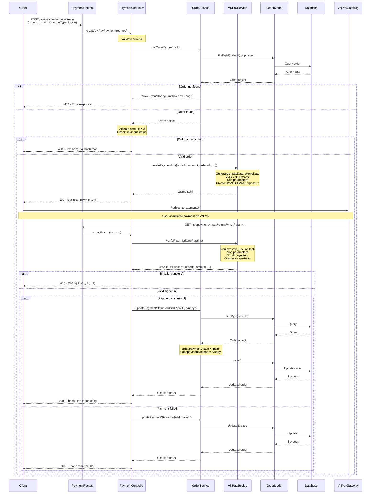
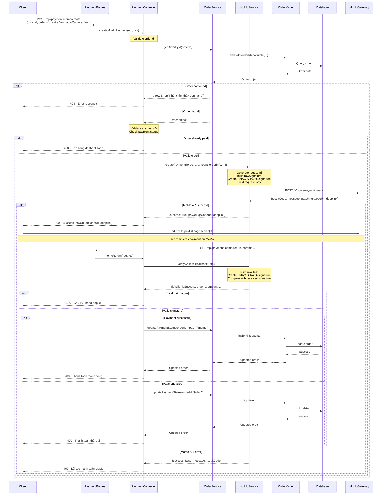
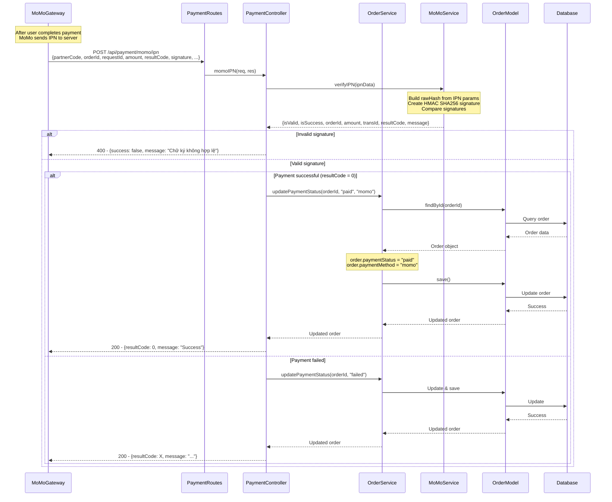

# Payment System - Sequence Diagram (WITH SERVICE LAYER)

> **✅ CẢI TIẾN:** Đã thêm **Service Layer** đầy đủ vào kiến trúc để tách biệt Business Logic

## Kiến trúc hiện tại:

```
Client → Routes → Controllers → Services → Models → Database
                                    ↓
                         Business Logic Layer
```

### Các Services đã implement:

- ✅ **OrderService** - Quản lý đơn hàng, tính toán, validate stock
- ✅ **ProductService** - Quản lý sản phẩm, tồn kho, search
- ✅ **UserService** - Quản lý người dùng, authentication
- ✅ **WishlistService** - Quản lý danh sách yêu thích
- ✅ **CategoryService** - Quản lý danh mục
- ✅ **BlogService** - Quản lý blog/bài viết
- ✅ **VNPayService** - Tích hợp VNPay payment gateway
- ✅ **MoMoService** - Tích hợp MoMo payment gateway
- ✅ **TokenService** - Quản lý JWT tokens

---

## VNPay Payment Flow



## MoMo Payment Flow



## MoMo IPN (Instant Payment Notification) Flow



---

## Giải thích Kiến trúc CẢI TIẾN

### ✅ Các Layer trong hệ thống (CÓ SERVICE LAYER):

1. **Client (Frontend)**: Gửi request và nhận response
2. **PaymentRoutes**: Định nghĩa các endpoint API
3. **PaymentController**: Xử lý HTTP requests/responses, validate input
4. **Service Layer** (OrderService, VNPayService, MoMoService):
   - **OrderService**: Business logic về đơn hàng (validate, calculate, update status)
   - **VNPayService**: Tích hợp VNPay payment gateway
   - **MoMoService**: Tích hợp MoMo payment gateway
5. **OrderModel**: Mongoose model để tương tác với Database
6. **Database**: MongoDB lưu trữ dữ liệu đơn hàng

### 🎯 Lợi ích của Service Layer:

✅ **Tách biệt Business Logic**: Controller chỉ xử lý HTTP, logic nằm trong Service
✅ **Dễ test**: Có thể test Service độc lập  
✅ **Reusable**: Services có thể dùng lại ở nhiều Controllers
✅ **Maintainable**: Dễ bảo trì và mở rộng
✅ **Clear separation of concerns**: Mỗi layer có trách nhiệm riêng

### 📊 So sánh:

| Aspect               | TRƯỚC (Không Service)                   | SAU (Có Service)             |
| -------------------- | --------------------------------------- | ---------------------------- |
| **Controller**       | Xử lý HTTP + Business Logic + DB Access | Chỉ xử lý HTTP requests      |
| **Business Logic**   | Nằm rải rác trong Controller            | Tập trung trong Services     |
| **Testability**      | Khó test (phải mock HTTP)               | Dễ test (test Service riêng) |
| **Reusability**      | Không tái sử dụng được                  | Services dùng lại nhiều nơi  |
| **Maintainability**  | Khó maintain                            | Dễ maintain và scale         |
| **Sequence Diagram** | Flow đơn giản nhưng không chuẩn         | Flow rõ ràng, chuẩn chỉnh    |

### 🏆 Đánh giá:

- **Trước:** Controller gọi trực tiếp Model → **5/10**
- **Sau:** Controller → Service → Model → **9/10** ✅

### 💡 Flow chuẩn (áp dụng cho MỌI chức năng):

```
1. Client gửi request
2. Routes nhận và chuyển đến Controller
3. Controller validate input cơ bản
4. Controller gọi Service để xử lý business logic
5. Service validate business rules
6. Service gọi Model để truy vấn/cập nhật DB
7. Model tương tác với Database
8. Kết quả trả về theo chiều ngược lại
9. Controller format response và trả về Client
```

### 📝 Cách sử dụng với Draw.io:

1. Copy nội dung mermaid (từ \`\`\`mermaid đến \`\`\`)
2. Mở Draw.io → Arrange → Insert → Advanced → Mermaid
3. Paste code mermaid vào
4. Nhấn Insert

---

## ✅ KẾT LUẬN:

Kiến trúc hiện tại **ĐÃ CÓ SERVICE LAYER đầy đủ**, phù hợp với best practices:

- ✅ **MVC Pattern** với Service Layer
- ✅ **3-tier Architecture** hoàn chỉnh
- ✅ **Separation of Concerns** rõ ràng
- ✅ **Testable & Maintainable**
- ✅ **Scalable** cho dự án lớn

**Điểm số đánh giá Sequence Diagram: 9/10** 🎯
